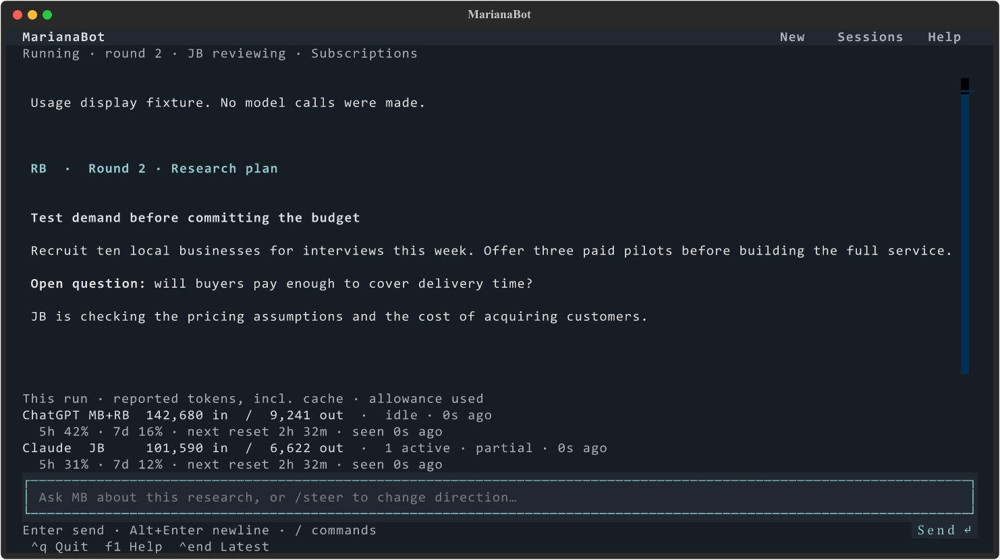

# MarianaBot

MarianaBot is a terminal chat with a research team, an independent critical review
team, and a master coordinator. Paste your business problem into its multiline
editor; the teams work in the background while you ask questions and steer them.

~~~text
                         YOU
                          |
                   MB · GPT-6 Astra
                brief / questions / steering
                          |
   RB · GPT-6 Astra       |        JB · Claude Opus 5
   independent proposals -+-----> independent critiques
   compare + synthesize <------- compare + next challenge
                          |
               plans, evidence, checkpoints
~~~

**Subscription mode:** MB and RB use the official Codex CLI with your ChatGPT login.
JB uses the official Claude Code CLI with your Claude subscription login.
MarianaBot never calls the paid APIs directly and removes API-key overrides from
client environments. Model access still depends on your account.

## Try it without using any subscription allowance

Python 3.11 or newer:

~~~powershell
python -m venv .venv
.\.venv\Scripts\python.exe -m pip install -e ".[dev]"
.\.venv\Scripts\python.exe -m marianabot chat --demo
~~~

On Linux/macOS:

~~~bash
python3 -m venv .venv
.venv/bin/python -m pip install -e ".[dev]"
.venv/bin/mariana chat --demo
~~~

Type a problem and press Enter. The demo uses deterministic fixtures and performs
two research/review rounds without network or model calls. It saves exports under
.mariana/demo/exports/. For a noninteractive demonstration, use `mariana demo --plain`.

On Windows, double-click **MarianaBot.cmd** after installation to open normal chat.
From an activated environment, simply run **mariana**. Long pasted text stays
editable; Enter sends, Alt+Enter or Ctrl+J inserts a newline. Drafts save locally.

## Set up a real run

For an existing Windows laptop installation, see the [short laptop guide](docs/laptop.md).

Read [subscription setup](docs/subscriptions.md) first. API keys do not draw from
Plus or Pro subscriptions. Extra usage and automatic credit purchases must be off
in the provider accounts before enabling a live run.

~~~text
mariana init
mariana doctor
mariana
~~~

The first command creates a local mariana.toml. Set subscription.overage_disabled
to true only after checking the provider billing settings yourself.
The configuration defaults to false; live inference is blocked until it is set.

MB turns the initial problem into a brief with constraints, assumptions, success
criteria and questions. Three RB specialists independently work on the brief, then
an RB chair compares their proposals. Three JB critics independently challenge the
plan, then a JB chair compares objections and produces the next research prompt.

Specialist count and concurrency are separate settings. Defaults are three
specialists per brain, scheduled one at a time to conserve subscription headroom
and Pi memory. Increase concurrency to run multiple specialists simultaneously.
MB and RB always share the same OpenAI gate.

## Stay in control

Type commands directly in the chat. Type `/` to see suggestions, use the arrow
keys and Tab to choose one, or press F1 for help:

~~~text
/ask What is the weakest assumption so far?
/steer Focus on Hungary and require a pilot below EUR 500.
/pause
/resume
/sessions
/usage
/export
/quit
~~~

Ordinary follow-up text also goes to MB. `/steer` updates the brief at the next
round boundary and resets convergence tracking. `/pause` and `/stop` are local
controls that do not need a model response. `/stop` permanently ends research.

The app starts and manages its own hidden worker and agent processes. **Closing
chat leaves research running**; reopen it to reconnect. Use `/pause` first to
suspend research. Keep the laptop awake and online. Rebooting needs a manual
`/resume`; completed calls are reused. `/new` opens another draft; one session can
research at a time in each data directory. MB can answer questions about finished
or paused runs without restarting research.

`/load path` loads a UTF-8 problem file for editing, `/copy` copies the latest plan,
and `/retry` retries unanswered MB messages. The original scriptable CLI remains
available; see [CLI operations](docs/operations.md).

## What is persisted

Every completed agent response, its input prompt, model, usage metadata, source
metadata, each round's plan and review, MB conversation, and observed quota resets.
A single-worker lock prevents duplicate workers in one data directory.
SQLite checkpoints let a restarted process skip completed agent tasks.

Exports include:

- report.md: current brief, latest completed plan, critical review and owner conversation.
- history.json: full local run record, completed prompts and responses.
- conversation.md: the saved chat transcript.
- citations.md: model-cited URLs, explicitly labeled as unverified.

Research data and logins are not pushed to GitHub. Local reports can contain your
confidential business information; keep the data directory private.

## Usage limits and practical boundaries

A fixed strip above the editor shows ChatGPT (MB + RB) and Claude (JB) throughout
research: reported input/output tokens, active calls, allowance used, reset
countdowns and snapshot age. It stays visible while scrolling or typing commands,
including in an 80-column terminal. Token counts cover the working MarianaBot run;
allowance snapshots cover the provider account.

The screen refreshes every 0.75 seconds. Claude token reports update during a call
when its stream supplies them; Codex reports totals at turn completion. Missing
counts display as unknown and incomplete totals are labeled partial. Input counts
include cached tokens without counting them twice. There is no guessed token balance
or inference from generated text. See [usage reporting](docs/usage.md).

Codex account usage is checked before each MB/RB dispatch and every 60 seconds
while a live worker is running, without generating model tokens. Claude's reported
usage/reset events are recorded as they arrive. The worker waits at the configured
usage threshold or after a limit rejection, using a reported reset when available.
If Claude supplies no reset, it waits a conservative interval before retrying.
Unknown usage is shown as unknown, never as a fabricated balance.

A provider may count a request before the client reports its outcome. Interrupted
requests are recorded as unknown and may consume usage again if retried.
Other apps share your subscription allowance. No local wrapper can promise exact
remaining capacity or prevent charges if paid overage is enabled in your account.

Rounds stop at configured time/round limits, sustained qualified approval, a score
plateau, or a request for human evidence. A higher reviewer score is **not proof**
of a stronger business. The prompts preserve dissent, uncertainties and experiments
that could disprove the recommendation.

## Documentation and verification

- [Subscription authentication and billing](docs/subscriptions.md)
- [Architecture and recovery](docs/architecture.md)
- [CLI operations](docs/operations.md)
- [Raspberry Pi deployment](docs/raspberry-pi.md)
- [Validation and milestones](docs/validation.md)

Offline tests exercise orchestration, interruption/resume, mailbox handling,
stopping conditions, quota events, subprocess protocol contracts, chat interaction,
long pastes, draft recovery and detached worker reconnection. Small live
checks passed for both Astra and Opus 5 using the owner's subscription logins.
A full live research run, real quota-reset cycle and Raspberry Pi deployment
remain to be verified. See the validation record for exact scope and usage.
