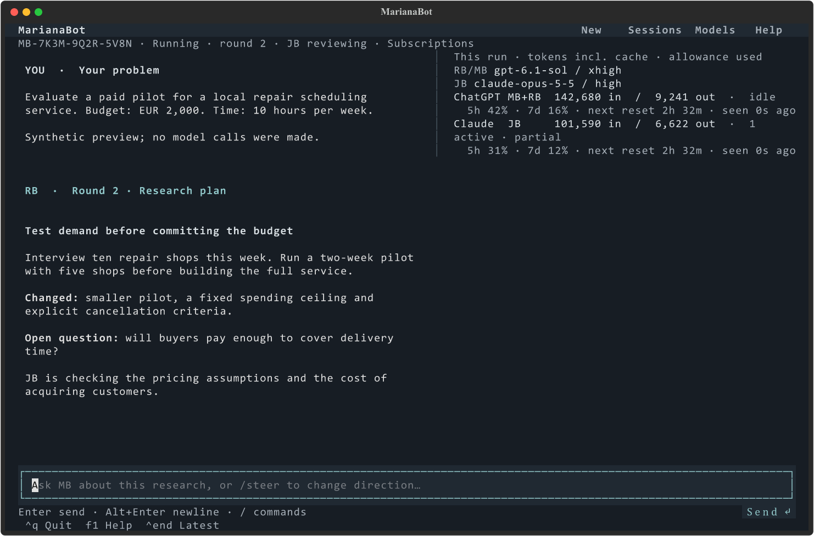

# MarianaBot

A personal research workspace in your terminal. Describe a business problem,
let a research team build a plan, and let a separate review team challenge it.
Ask questions or change direction while they work. Each round, critique and
decision stays in a local research history.



MarianaBot runs on **your own computer by default**, using your own ChatGPT and
Claude subscription logins through the official Codex and Claude Code clients.
Cloning this repository does not connect to the author's computer, server or accounts.
An [optional personal VPS setup](docs/cloud-server.md) keeps work running when
your laptop is off. There is no shared MarianaBot hosting service.

## Install

You need Git and Python 3.11 or newer. For live research, install
[Codex](https://learn.chatgpt.com/docs/cli) and
[Claude Code](https://code.claude.com/docs/en/setup), with subscription access to
your chosen models. Opus 5.5 requires Claude Code 2.1.280 or newer.

```text
git clone https://github.com/Dang3rK1LL/MarianaBot.git
cd MarianaBot
```

Windows PowerShell:

```powershell
python -m venv .venv
.\.venv\Scripts\python.exe -m pip install -e .
.\.venv\Scripts\mariana.exe setup
.\MarianaBot.cmd
```

Linux or macOS:

```bash
python3 -m venv .venv
.venv/bin/python -m pip install -e .
.venv/bin/mariana setup
.venv/bin/mariana
```

The setup wizard asks for model IDs and effort levels. Press Enter to keep the
defaults: **GPT-6 Astra / high** for research and coordination, and
**Claude Opus 5.5 / medium** for critique. Medium follows Anthropic's current
[Opus 5.5 guidance](https://code.claude.com/docs/en/model-config).
You can enter future model IDs without waiting for a MarianaBot update.
Your provider must support the model and effort you choose.

Before live use, sign in from a terminal:

```text
codex login
claude auth login --claudeai
```

Run `mariana doctor` from the activated environment, or use its full executable
path as above. It checks installation and account metadata without model inference.
Disable paid extra usage, usage credits and automatic credit purchases in both
provider accounts, then confirm this in setup. Live research stays locked until
you confirm. MarianaBot cannot inspect or change those billing settings.
See [subscription setup](docs/subscriptions.md).

To try the interface without logins or model usage, run
`mariana chat --demo`. It uses offline fixtures and a separate demo directory.

## Use it

Paste your problem into the editor. **Enter sends; Alt+Enter or Ctrl+J adds a
newline.** Long pastes remain editable. Include constraints, what you already
know, and what decision the research should help you make.

Before starting each live research run, choose a work folder. MarianaBot creates
a separate `research-RUN_ID` subfolder there for the problem, client workspace
and exported results. The default parent is `~/MarianaBot-work` on the host
running the research. Completed rounds refresh the results automatically.
The shared SQLite history still lets chat and Discord find all your sessions.

| Component | What it does |
|---|---|
| Master brain (MB) | Prepares the brief, answers you and applies steering; shares the research model and allowance |
| Research brain (RB) | Three independent specialists propose approaches; a chair compares them and writes the plan |
| Judging brain (JB) | Three independent critics challenge the plan; a chair combines objections into the next research prompt |

The teams alternate until a configured limit, qualified approval, a score plateau
or a need for human evidence. Defaults are 24 rounds and 72 elapsed hours.
Specialists run one at a time by default; count and concurrency are configurable.
More rounds and higher reviewer scores do not establish that a business will work.
The output includes uncertainties and tests you can carry out in the real world.

Type normally to ask MB a question. Type `/` to see commands:

| Command | Action |
|---|---|
| `/steer Focus on a pilot below EUR 500.` | Changes the brief at the next round boundary |
| `/pause` / `/resume` | Pauses or continues from saved checkpoints |
| `/stop` | Permanently ends this research run |
| `/sessions` / `/new` | Opens saved research or starts a new draft |
| `/models` | Changes models and efforts for new research |
| `/usage` | Refreshes account allowance and shows the full usage snapshot |
| `/memory` / `/pin exact wording` | Inspects memory or protects an instruction from summarization |
| `/export` | Writes the plan, transcript, history, memory and cited links |
| `/quit` | Closes chat while background research continues |

`/models` lists models reported by your signed-in Codex and Claude clients.
The effort menu follows the selected model; models without adjustable effort use
their default. Loading the lists does not generate model responses. Preferences
apply to new research, while existing runs keep their saved settings.

The app starts its worker and client processes itself. Reopening chat reconnects
to saved work. One research worker runs per data directory. On a laptop, keep it
awake and online; after reboot, reopen and `/resume`. A deliberately paused run
stays paused. See the [daily-use guide](docs/laptop.md) and
[scriptable CLI](docs/operations.md).

## Usage and memory

ChatGPT and Claude usage stay visible above the editor: reported input/output
tokens, active calls, account allowance and reset times when provided. Missing
values stay unknown; incomplete totals are marked partial. This is provider
telemetry, not a guaranteed live balance. Other apps share your allowance.

The worker waits at the configured usage threshold or after a limit rejection.
It uses reported reset times where available and a conservative retry interval
otherwise. It does not purchase credits or switch to API billing.
See [usage reporting](docs/usage.md) for what each provider exposes.

Older research is automatically summarized through MB. The current brief,
protected notes, blockers and dissent are retained; original material and
compaction records remain on disk. Summaries can lose nuance, so pin anything
that must keep its exact wording. If protected material cannot fit, research
pauses. The [memory guide](docs/memory.md) explains the working context budget.

## Your data and your server

Settings live in `mariana.toml`; research and exports default to `.mariana/`.
Both are excluded from Git. Provider logins stay in the official clients' own
storage. Prompts and relevant research are sent to the selected model providers;
native web search can contact external services. Exported citation links have
not been independently verified by MarianaBot.

**MarianaBot.cmd** runs locally. **MarianaBot-Server.cmd** connects only to the
server specified in your own local `mariana-server.json`; it cannot connect
until you create that profile and establish SSH trust. Local and server research
are separate stores, with no automatic synchronization. Server exports stay on
the server until downloaded. Follow the [VPS guide](docs/cloud-server.md) to
install on your own machine, with persistent sessions and daily local backups.

Public source code does not publish your running installation. Git exclusions
are an accident-prevention measure, not access control: keep research, backups,
SSH keys and client credentials private. Read the [security notes](SECURITY.md).

## Optional Discord connection

Follow research stages, findings, changes and usage in clean cards from your own
private Discord channel. The optional
integration supports `/mariana ask`, `steer`, `pause`, `resume` and status updates.
You create your own bot, choose allowed users, and explicitly select which run to
share. It is disabled by default, with private credentials kept outside Git.
Follow the [Discord setup guide](docs/discord.md).

## Automatic updates

MarianaBot checks GitHub on startup and installs available updates when the
installation is idle. It prepares and checks a separate environment before
switching versions. Running research, open chat, Discord, or local source edits
defer installation; a failed download or package install keeps the existing
version available. Your settings, credentials and research stay in place.

Use `mariana update --check` to check manually, `mariana --no-update` to skip one
startup check, or `[updates] enabled = false` in `mariana.toml` to disable it.
Laptop and VPS installations update independently. See [startup updates](docs/updates.md).

## Development

```text
python -m pip install -e ".[dev,discord]"
python -m ruff check src tests scripts
python -m ruff format --check src tests scripts
python -m pytest -q
```

Tests and CI use offline fixtures. Live connectivity checks are separate and
consume subscription allowance. See [testing](docs/testing.md) for coverage and
development tools, and [architecture](docs/architecture.md) for scheduling,
recovery and stop conditions. This is a personal-use project; multi-day research
quality and a real exhaustion/reset cycle still need broader validation.
