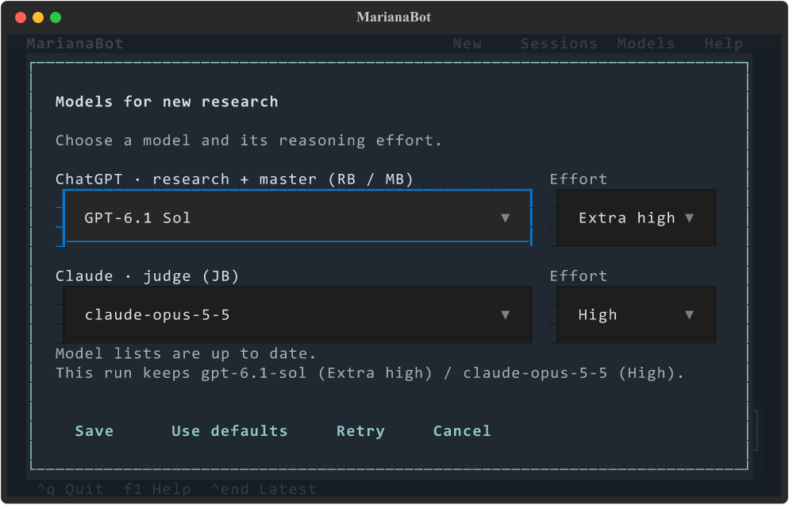

# MarianaBot on your laptop

**Double-click `MarianaBot.cmd` in the project folder.** The chat opens directly.
Alternatively, in PowerShell:

```powershell
cd MarianaBot
.\.venv\Scripts\mariana.exe
```

Paste or type your business problem, including constraints and the result you
want. **Enter sends it. Alt+Enter or Ctrl+J adds a newline.** Multiline pastes stay
in the editor until you send them. The first problem can contain up to 100,000
characters; later messages up to 20,000. `/load path\to\problem.md` loads a text
file into the editor without sending it. Unsent drafts save automatically.

## While the team works

MB turns your problem into a research brief and lists assumptions and
questions. By default, three RB specialists develop independent proposals; their chair
compares and combines them. Three JB critics challenge the plan; their
chair writes a review and the next prompt for RB. You see each brief, combined plan
and review in the conversation. Expand long messages to read them in full.

Ask MB a question by typing normally. Use `/steer` to change the brief or answer
MB's initial questions so those answers affect subsequent research.

The info panel stays at the upper right, or above the conversation in terminals
narrower than 120 columns. Typing commands or a longer draft leaves it in place.
ChatGPT covers MB + RB; Claude covers JB. The model row shows each model and its
reasoning effort. Provider rows show this run's reported input/output tokens and account allowance
used, reset countdowns and snapshot age. Counts refresh as client reports arrive;
Codex totals arrive at turn completion, while Claude can report intermediate usage.
`partial` means some usage has not been reported. See [usage reporting](usage.md).
The editor grows for long drafts, and all controls remain visible at 80×24.

| Type in chat | Result |
|---|---|
| `/steer Limit the pilot to EUR 500.` | Changes the brief before the next round |
| `/pause` | Cancels active requests and keeps completed work |
| `/resume` | Continues this research from saved checkpoints |
| `/stop` | Permanently ends research; the plan remains saved |
| `/sessions` | Opens saved conversations |
| `/new` | Opens a fresh draft |
| `/usage` | Shows provider-reported usage and reset times |
| `/models` | Chooses model IDs and effort for new research |
| `/memory` | Shows working memory and protected note IDs |
| `/pin Keep the pilot below EUR 500.` | Preserves exact wording in future requests |
| `/unpin ID` | Releases an obsolete protected note; keeps its archive |
| `/export` | Saves a report, transcript, history and citations; prints the folder |
| `/retry` | Retries pending MB messages after a failed reply |
| `/quit` | Closes chat; background research continues |

Type `/` for suggestions, use ↑/↓ and Tab to complete a command. **F1** opens help;
**Ctrl+O** opens sessions, **Ctrl+L** focuses the editor, **Ctrl+End** jumps to the
latest message, and **Ctrl+Q** closes chat. Shift+Enter also inserts a newline in
terminals that support it. F7 selects the entire draft; Ctrl+Z undoes edits.

Click **Models** or type `/models` to change either provider's model and effort.
**Use defaults**, then **Save** restores the [default models and efforts](../README.md#install).
Choose from the live model lists reported by your signed-in
clients. Effort options change with the selected model; models without adjustable
effort show a disabled **Default** field. If a list cannot load, check that client's
login and use **Retry**. New models appear when the client reports them. MarianaBot
does not request a fallback model. Saved choices affect new runs, while an
existing conversation retains its original settings. MB and compaction use the
research model. The screen shows the current run's choices when one is open.



Older research is automatically summarized using MB's allowance. The current
brief, pins and recorded objections stay verbatim; full originals remain saved.
Use `/memory` to inspect this and `/export` for `memory.md` and the source archive.
Summaries can miss detail; pin anything that must always be present. See the
[memory guide](memory.md) for exact retention and recovery behavior.

## What runs automatically

MarianaBot launches a hidden research worker and manages the official client
processes itself. No second terminal is needed. Closing the chat window leaves
research running; reopening reconnects to the saved session. `/sessions` lets you
switch conversations. Only one worker uses a data directory at a time; pause an
existing research run before submitting a new problem. MB can answer questions
about paused or finished research without resuming the research loop.

Default settings schedule the three specialists in each team one at a time. Raise
the concurrency settings in `mariana.toml` before creating a new run if you want
simultaneous specialists. MB and RB share OpenAI capacity; JB uses Claude capacity.
All three respect reported cooldowns. MB replies may wait behind a research call
or for OpenAI usage to reset. Unknown Claude usage is shown as unknown.

Live chat refreshes Codex and Claude allowance at every application start and every minute
while open, including when research is idle or paused. Reopening the cloud
shortcut also requests fresh limits when it reattaches to an existing chat.
`/usage` refreshes both providers' limits on demand and works before starting research.
These checks read account metadata without model prompts. If a check fails,
the last successful snapshot stays visible with its original timestamp and a
refresh-failed label for that provider. A slow or failed check does not block the
other provider's display. Offline demos do not fetch account limits.

Research ends at 24 rounds or 72 elapsed hours by default, or earlier on sustained
approval, a plateau, or a need for human evidence. For a human-evidence pause,
provide that evidence with `/steer`, then `/resume`. Reviewer scores express model
judgment; test the recommendations with real customers and evidence.

Keep the laptop awake and connected to the internet. Laptop sleep suspends work;
closing the lid may trigger sleep. Pause before planned shutdown. After a reboot,
open chat and `/resume` unfinished research. The elapsed-time deadline includes
sleep and pauses. No Windows service or power-setting change is installed.

## Local setup and a free demo

Run `mariana setup` to select models and configure live use. Existing provider
logins are retained. This records your confirmation that usage credits are off;
it does not independently inspect provider billing settings. Configuration and
research stay local and outside Git.

To explore without subscription usage:

```powershell
.\.venv\Scripts\mariana.exe chat --demo
```

The demo uses clearly labeled fixtures. Normal chat also supports `/demo`, then
`/new` to return to the normal mode. For a new installation, follow the one-time
setup in [README](../README.md) and [subscription setup](subscriptions.md).

Use `mariana new`, `run`, `ask`, and the other shell commands for automation.
See [CLI operations](operations.md) for those commands and diagnostics.
